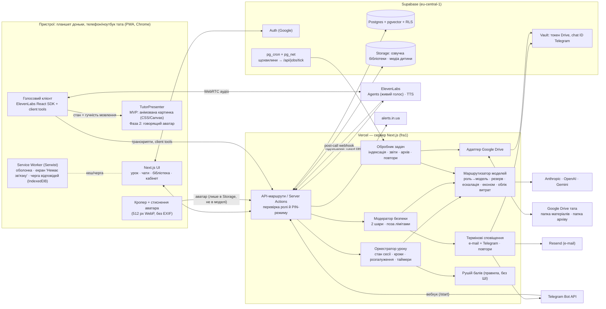
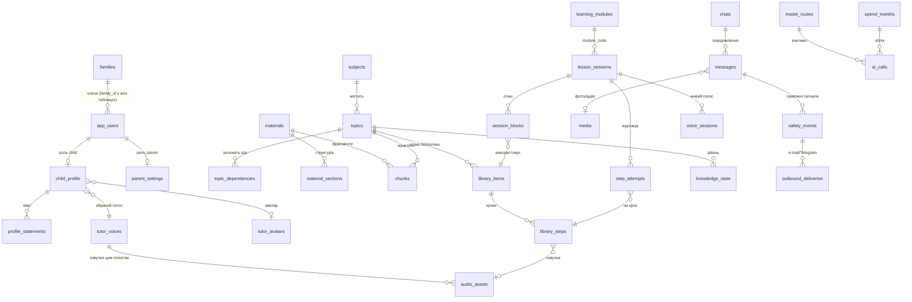
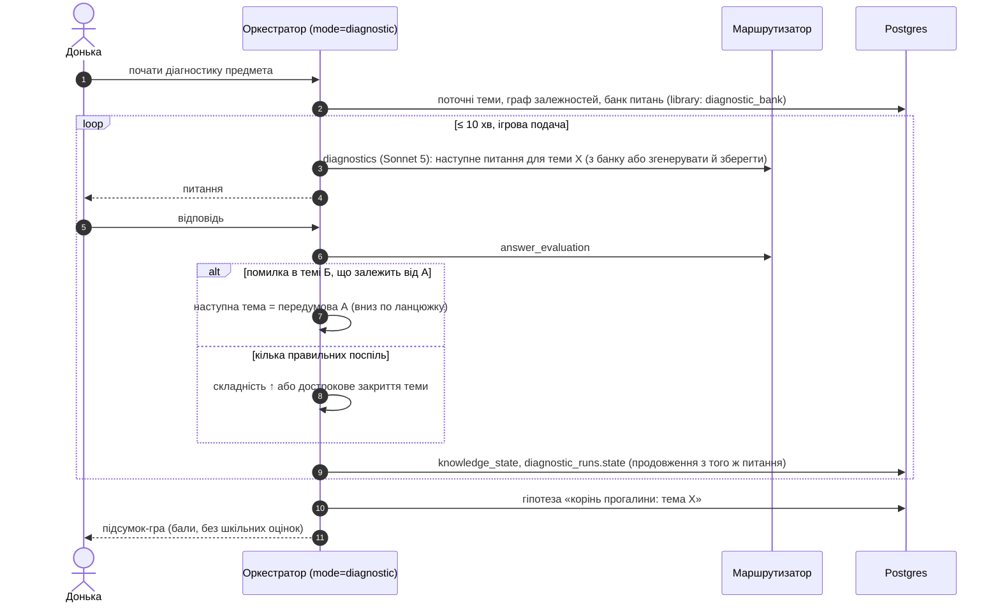
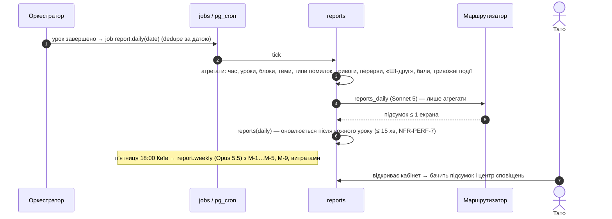
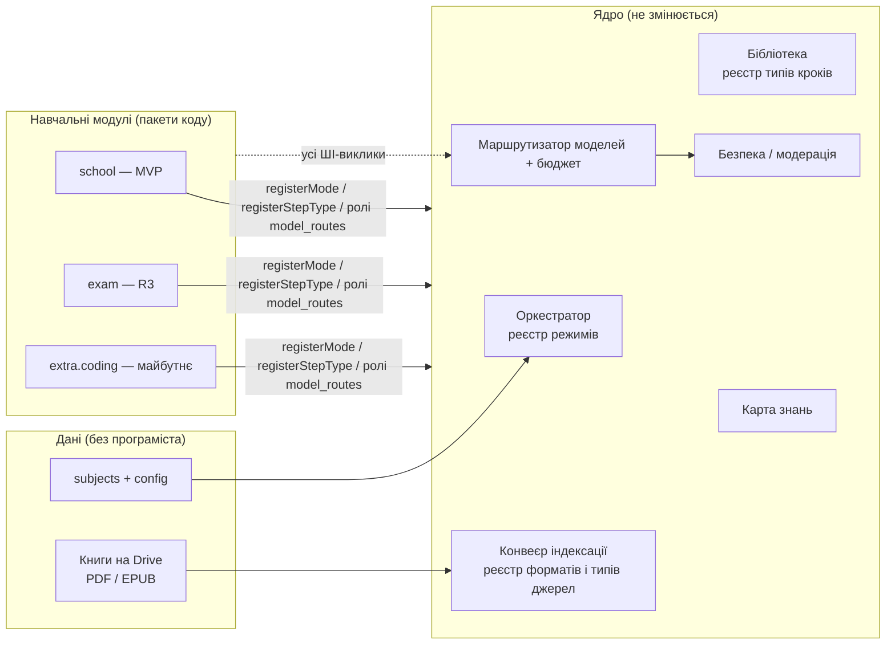

# Архітектура — ШІ-Репетитор

| Поле | Значення |
|---|---|
| Версія | 0.3 (на затвердження, Фаза 1; оновлено 2026-09-25 за стратегічними рішеннями Алекса: старт «Економ», модульність — ADR-017, готовність до комерціалізації — ADR-018; **0.3 — образ репетитора: ім'я й голос обирає дитина, аватар-картинка з модерацією, анімація за станами голосу — розд. 7.6, ADR-006, ADR-019**; **0.3.1 (2026-09-25) — модерацію аватара прибрано з MVP (ADR-019, ADR-018); інтерактивні компоненти уроку — розд. 14.3, ADR-020**) |
| Дата | 2026-09-25 |
| Автор | `architect` |
| Вхідні | `docs/00-product-brief.md`, `docs/01-requirements.md` v0.3 (затв. 2026-09-25), `docs/05-backlog.md` v0.3 |
| Пов'язані | `docs/03-resources-and-costs.md` (акаунти, ключі, кошторис), `docs/adr/001…020` |

> **Як читати.** Розділи 0–3 — для Алекса: що будуємо, з чого і чому (без коду). Розділи 4 і далі — для розробника: як саме.
> Посилання `US-…`, `NFR-…`, `D-…`, `AR-…` — з `docs/01-requirements.md`. `ADR-NNN` — файли в `docs/adr/`.

---

## 0. Коротко для Алекса (1 екран)

**Що це технічно.** Один веб-застосунок (PWA), який живе в інтернеті й відкривається з іконки на планшеті. У нього три «опори»:

1. **Vercel** — «сервер» застосунку: показує екрани й робить усі виклики до ШІ. Ключі до ШІ лежать тільки тут. Тариф — безкоштовний.
2. **Supabase** — «база й сховище»: акаунти, уроки, чати, карта знань, аудіо й фото. Для розробки — безкоштовний тариф; для щоденного використання донькою — **Pro $25/міс** (резервні копії, без «засинання», достатньо місця) — **погоджено 2026-09-25**.
3. **ШІ-провайдери:** Anthropic Claude (головний «вчитель»: уроки, оцінювання, чат), OpenAI і Google Gemini (резерв, розпізнавання фото, пошук), **ElevenLabs** (голос репетитора: живий діалог і озвучка пояснень).

**Образ репетитора обирає донька** (рішення 2026-09-25): ім'я (з підказок або своє, з автоматичною перевіркою), голос — жіночий або чоловічий з кількох українських голосів, які ви попередньо прослухаєте й затвердите, і аватар — готовий або своя картинка. Картинка зберігається приватно, стискається й очищується від метаданих і **не передається жодному ШІ чи сторонньому сервісу**; автоматичної перевірки в MVP немає (ваше рішення 2026-09-25) — ви бачите кожну зміну в кабінеті й можете замінити або скинути аватар. Аватар «оживає» простою анімацією (слухаю / думаю / говорю) — $0. Зміна голосу: нові уроки одразу звучать новим голосом, старі переозвучуються **лише коли донька їх відкриває** — у «Економі» ≈ **$0–9 за місяць після зміни** (розд. 7.6). «Говорящий» аватар з рухом губ — Фаза 2, окреме рішення про вартість.

**Як урок працює.** Урок веде не «вільна» модель, а **оркестратор** — сценарій із кроками (слайд → питання → оцінка → розгалуження), який зберігає кожен крок. ШІ-моделі виконують окремі ролі (пише урок, оцінює відповідь, говорить голосом, стежить за безпекою). Яка модель виконує яку роль — видно й змінюється у вашій **таблиці моделей** у кабінеті.

**Скільки коштує** (деталі — `docs/03-resources-and-costs.md`): 30-хв урок з живим голосом ≈ **$2,7** (новий) / **$1,4** (повтор з бібліотеки); 45-хв ≈ **$4,1 / $2,0**. У $100 вміщується ≈ **48** 30-хв голосових уроків на місяць (половина нових, половина з бібліотеки) або ≈ **1 урок на навчальний день плюс «ШІ-друг»**. У $200 — удвічі більше. Голос «ШІ-друга» — **10 хв/день за замовчуванням** (≈ **$30/міс**, рішення 2026-09-25). Ліміт $100 — лише для ШІ-витрат; інфраструктура (Supabase Pro $25 + ElevenLabs Creator $22) — окремо. Разом на місяць: Економ ≈ **$111**, Базовий ≈ **$163**, Комфорт ≈ **$216** (при ліміті $100 — не більше ≈ $147 + запас жорсткої межі). **MVP стартує в сценарії «Економ»** (≈ 1 урок 30 хв/день, рішення 2026-09-25); інші — після тестування.

**Модульність і «на виріст».** Нові предмети й будь-які книги з Drive (не лише підручники) додаються **даними**, без програміста; нові навчальні модулі (напр., «Додаткове навчання: програмування», підготовка до іспитів) — підключаються до готового ядра, не переробляючи його (розд. 14.1, ADR-017). У базі одразу закладено поняття «сім'я», щоб за бажання колись відкрити продукт іншим сім'ям без переписування (розд. 14.2, ADR-018). Обидва рішення — $0 на місяць.

**Що від вас потрібно** — покроковий чекліст у `docs/03-resources-and-costs.md` (розділ 1): акаунти, ключі, Telegram-бот, закрити доступ до папки Drive.

---

## 1. Принципи архітектури (AR-0)

| # | Принцип | Як застосовано |
|---|---|---|
| A-P1 | **Якість навчання понад економію** (P-Q, D-33, NFR-COST-10). | Для кожної ролі основна модель обрана за якістю українською й точністю (розд. 7.3). Дешевші моделі — лише як **економ-модель** у режимі бюджету (D-27) або як резерв. У кожному ADR з вибором «дешевше / якісніше» — дешевша альтернатива і причина, чому її не обрано. |
| A-P2 | **Економія — через перевикористання, а не через слабші моделі** (P-R, D-34). | Бібліотека уроків (E-19): урок генерується й озвучується **один раз**; повтори й повторення — без генерації. Живий голос вмикається лише на діалогових кроках і закривається після 60 с тиші. |
| A-P3 | **Найпростіше, що задовольняє вимоги.** | Один Next.js-застосунок (моноліт), одна база Postgres. Без мікросервісів, окремих черг і Kubernetes: фонові задачі — таблиця `jobs` у Postgres + планувальник `pg_cron` (ADR-015). |
| A-P4 | **Брати готове.** | Керовані сервіси (Vercel, Supabase, ElevenLabs Agents, Resend, Telegram Bot API), бібліотеки (Vercel AI SDK, Serwist для PWA, pdf.js/unpdf для PDF). |
| A-P5 | **Безпека дитини не вимикається нічим** (P-S, NFR-SAFE-13). | Модератор безпеки — окремий шлях, що обходить ліміти бюджету; має резервного провайдера; термінові сповіщення — два незалежні канали (ADR-009, ADR-010). |
| A-P6 | **Секрети лише на сервері, мінімум даних дитини в моделях** (CLAUDE.md, NFR-PRIV). | Ключі — змінні середовища Vercel; отримані під час роботи секрети (токен Drive, chat ID Telegram) — Supabase Vault (зашифровано). Моделям — лише нікнейм; ім'я й фото з Google не зберігаються (розд. 11). |
| A-P7 | **Жодних лімітів часу** (P-T, D-32). | В архітектурі немає денних лімітів навчання й обмежень годин; єдині обмеження — бюджетні (US-11.5) і денний ліміт живого голосу «ШІ-друга» (US-7.2). |
| A-P8 | **Готовність до еволюції без переробки** (NFR-PLAT-4). | Точки розширення під офлайн (R2), аватар (Фаза 2), приватний чат, модуль іспитів, інтерактивні візуалізації — розд. 14. |
| A-P9 | **Модульність — ключовий принцип** (рішення Алекса 2026-09-25). | Ядро (оркестратор, маршрутизатор, безпека, бюджет, бібліотека, карта знань) + підключувані **предмети** (дані), **типи джерел** (стратегії індексації) і **навчальні модулі** (реєстри режимів і типів кроків). Модуль імпортує ядро, ядро не знає про модулі; модуль не може обійти модерацію й бюджет (ADR-017). |
| A-P10 | **Дешева готовність до комерціалізації, без передчасного SaaS.** | `family_id` + RLS за сім'єю, конфігурація в БД замість хардкоду, інтеграції через одну функцію; оплати, реєстрація, юридичне — відкладено (ADR-018). |

---

## 2. Стек і обґрунтування (AR-1)

Відправну точку з опису ролі **прийнято з уточненнями** (ADR-001).

| Шар | Рішення | Чому | Дешевша/простіша альтернатива і чому ні |
|---|---|---|---|
| Клієнт | **Next.js (App Router, TypeScript) як PWA**; сервіс-воркер — **Serwist**; UI — React + Tailwind (дизайн-система — `designer`) | Один код для планшета дитини й кабінету тата; встановлюється з Chrome (US-1.4); SSR швидко відкривається (NFR-RES-4). | Нативний Android — поза MVP (бриф 3). |
| Сервер | **Route Handlers / Server Actions Next.js на Vercel**, регіон функцій **fra1 (Франкфурт)** | Усі ШІ-виклики й секрети — на сервері (NFR-PRIV-3). Функції до 300 с на безкоштовному тарифі (Fluid compute) — вистачає для генерації блоку й кроків індексації. | Vercel Pro ($20/міс) — не потрібен: частий cron замінює `pg_cron` (ADR-015). |
| База | **Supabase Postgres** + **pgvector** + **pg_trgm** + повнотекстовий пошук; **RLS** на всіх таблицях | Реляційні дані (теми, залежності, сесії) + векторний пошук в одній базі; RLS — розмежування ролей на рівні бази (NFR-PRIV-4). | Окрема векторна БД (Pinecone тощо) — зайвий сервіс. |
| Автентифікація | **Supabase Auth + Google OAuth**, allowlist у змінних середовища | Готовий вхід через Google для тата й доньки (US-1.1, 1.2). | Auth.js — більше коду, та сама якість (ADR-002). |
| Файли | **Supabase Storage** (приватні бакети) | Аудіо, фото, скріншоти, озвучка бібліотеки; підписані посилання з коротким терміном. | Google Drive як робоче сховище — повільно й ризиковано для приватності. |
| Фонові задачі | Таблиця **`jobs`** + **`pg_cron` + `pg_net`** (кожну хвилину викликає захищений маршрут Vercel) | Індексація, звіти, архів, повтори сповіщень — без окремої черги (A-P3). | Vercel Cron на Hobby — лише раз на добу; Upstash/QStash — ще один сервіс. |
| Доступ до ШІ | **Vercel AI SDK** з прямими провайдерами (`@ai-sdk/anthropic`, `@ai-sdk/openai`, `@ai-sdk/google`) + **власний маршрутизатор моделей** (таблиця в БД) | Єдиний інтерфейс до трьох провайдерів, структуровані відповіді (JSON-схеми), стрімінг; маршрутизація, резерв, економ-режим і облік витрат — під нашим контролем (ADR-004). | Vercel AI Gateway (готові фолбеки) — ще одна точка, де проходять дані дитини, і все одно потрібна наша таблиця ролей і облік бюджету; можна підключити пізніше без переробки. |
| Живий голос | **ElevenLabs Agents** (WebRTC, React SDK, **client tools**), голос з каталогу українських голосів (жіночі й чоловічі), затвердженого татом; `voice_id` передається override-ом на кожну сесію (розд. 7.6) | Найкраща природність української (NFR-LANG-4), готові перебивання й чергування реплік, client tools для керування екраном уроку (ADR-006). | Gemini Live — дешевше, але підтримку української в нативному аудіо не підтверджено; OpenAI Realtime — дорожче й голоси менш природні українською. |
| Озвучка пояснень | **ElevenLabs TTS** (Multilingual v2 / v3) **тим самим голосом**, що й живий агент | Один образ репетитора в усіх режимах (NFR-VOICE-1); кеш у бібліотеці (US-13.4). | Flash v2.5 (удвічі дешевше) — лише якщо на демо S12 Алекс не почує різниці (P-Q). |
| Аватар репетитора (MVP) | Картинка (готова або завантажена) у приватному бакеті Supabase Storage; **анімація CSS/Canvas** на клієнті за станами голосу; валідація формату/розміру й стиснення до 512 px WebP без EXIF; **без автоматичної модерації в MVP** — контроль тата (рішення PO 2026-09-25, ADR-019) | $0/міс; зображення не йде в жодні моделі чи сторонні сервіси (US-1.8, ВП-33) | Автоматична модерація (MediaPipe + `omni-moderation` + Cloud Vision) — зайва для одного користувача, перенесена в «при комерціалізації» (ADR-018); говорящий аватар — Фаза 2 |
| E-mail | **Resend** (безкоштовно, 3 000 листів/міс) | Простий API, доставка за секунди (NFR-PERF-11). | Gmail SMTP з паролем застосунку — пароль дає доступ до всієї пошти, ризиковано (ADR-010). |
| Telegram | **Telegram Bot API** напряму (вебхук) | Безкоштовно, без бібліотек-посередників (ADR-010). | — |
| Повітряні тривоги | **alerts.in.ua API** (основне), **api.ukrainealarm.com** (резерв, опційно) | Токен за запитом, дані по м. Київ, затримка секунди (ADR-011). | Парсинг Telegram-каналів — ненадійно. |
| Google Drive | **Сервісний акаунт** (читання папки матеріалів) + **OAuth `drive.file` тата** (запис архіву) | Найпростіший надійний варіант з урахуванням обмежень Google (розд. 10, ADR-003). | Лише OAuth у режимі Testing — токени зникають кожні 7 днів. |
| Моніторинг | Логи Vercel + таблиці `ai_calls`, `notifications`; (опційно) Sentry free | Достатньо для одного користувача. | — |

---

## 3. Схема компонентів



**Правило меж.** Браузер **ніколи** не звертається до ШІ-провайдерів напряму з ключем. Виняток — аудіопотік до ElevenLabs, але він відкривається лише за **одноразовим підписаним токеном**, який видає наш сервер після перевірки бюджету й ролі; API-ключ ElevenLabs лишається на сервері (ADR-006).

---

## 4. Модулі сервера (для розробника)

| Модуль | Відповідальність | Ключові вимоги |
|---|---|---|
| `auth` | Вхід Google, allowlist, ролі, PIN-режим тата, «режим дитини» (запасний) | US-1.1…1.6, NFR-PRIV-9, 11 |
| `drive` | Список і завантаження файлів папки матеріалів; перевірка публічності; запис архіву | US-2.1, 18.1, NFR-PRIV-7 |
| `ingest` | Витяг тексту PDF/EPUB, виявлення сканів, фрагментація, ембединги, структура «розділ → тема → сторінки», залежності тем | US-2.2…2.5 |
| `orchestrator` | Стан сесії, план уроку, кроки, розгалуження, перерви, пауза/продовження, бездіяльність | E-4, E-6, E-9, E-16, US-12.2 |
| `library` | Збереження/версії уроків, озвучка, повторне проходження, вибір збережених вправ | E-19, US-13.4 |
| `router` | Таблиця ролей, виклик моделі, резерв, ескалація, економ-режим, облік витрат, режими бюджету | E-13, US-11.5, NFR-COST |
| `safety` | Модерація кожної репліки дитини, класифікація, події, запуск термінових сповіщень | E-12, NFR-SAFE |
| `notify` | E-mail (Resend), Telegram (Bot API), повтори, тестове сповіщення, центр сповіщень | US-11.6, 11.7 |
| `voice` | Видача токенів сесії ElevenLabs, промпт-оверрайди, прийом транскриптів, post-call webhook, ліміт «ШІ-друга», облік хвилин | E-7, US-8.5 |
| `persona` | Образ репетитора: ім'я (перевірка), каталог голосів, вибір голосу, переозвучення «за потребою», аватар (завантаження, перевірка, заміна татом) — розд. 7.6 | US-1.6…1.8, NFR-VOICE-1, 4, NFR-SAFE-14, NFR-PRIV-12 |
| `chat` | Предметні чати, «ШІ-друг», пошук (гібридний), фільтри | E-8 |
| `knowledge` | Карта знань, типи помилок, інтервальне повторення, план дня | E-5, E-9 |
| `profile` | Профіль дитини (поведінкові твердження з доказами), редагування татом | E-10 |
| `reports` | Щоденний підсумок, тижневий звіт, витрати | US-11.1, 11.2, 11.5 |
| `points` | Бали, анти-вгадування, нагороди, запити — **детерміновані правила, без ШІ** | E-17, NFR-SAFE-12 |
| `homework` | ДЗ вручну і зі скріншотів «Єдиної школи» | US-9.3, 15.1 |
| `vision` | Фото зошита, скріншоти (зняття EXIF, стиснення, розпізнавання) | US-5.4, 15.1 |
| `alerts` | Статус повітряної тривоги (кеш), тестова тривога | US-14.4, 14.5 |
| `archive` | Щомісячний архів на Drive, перевірка повноти, видалення медіа | E-18 |
| `jobs` | Таблиця задач, `tick`-обробник, повтори, ідемпотентність | ADR-015 |

---

## 5. Оркестратор уроку (компонент 1 з 2)

> **Що це простими словами.** Оркестратор — «завуч» уроку. Він не ШІ, а програма з чіткими правилами: знає, на якому кроці дитина, що буде далі, коли запропонувати перерву, коли покликати ШІ-модель і яку саме роль. ШІ-моделі — «вчителі-виконавці», які отримують від оркестратора лише потрібний контекст.

Реалізація: **детермінований скінченний автомат на сервері** (TypeScript), стан — у Postgres. Не використовуємо «агентні фреймворки», де модель сама вирішує, що робити: для дитячого навчання важливі передбачуваність, збереження кожного кроку й тестованість (ADR-007).

### 5.1. Стани сесії

```mermaid
stateDiagram-v2
  [*] --> Idle
  Idle --> Diagnostic: "Почати діагностику"
  Idle --> Lesson: "Почати урок" / "Інший предмет"
  Idle --> Review: повторення за графіком / бібліотека
  Idle --> Friend: "ШІ-друг"
  Diagnostic --> Paused
  Lesson --> Practice: після пояснення блоку
  Practice --> Lesson: наступний блок
  Lesson --> Break: 20 хв роботи + кінець блоку (можна пропустити)
  Break --> Lesson
  Lesson --> Paused: "Тривога" / банер тривоги / 3 хв бездіяльності / немає мережі / 110% бюджету
  Practice --> Paused
  Review --> Paused
  Paused --> Lesson: "Продовжити" (той самий крок; >24 год — слайд-нагадування)
  Lesson --> Summary: час уроку вичерпано → після поточного блоку
  Practice --> Summary
  Review --> Summary
  Diagnostic --> Summary
  Summary --> Idle: "Ще урок" лише дією дитини
  Friend --> Idle
```

| Режим (`mode`) | Що відбувається | Хто з ролей діє |
|---|---|---|
| `diagnostic` | Адаптивні питання по ланцюжку залежних тем до кореня прогалини (US-4.2); ≤ 10 хв на сеанс | `diagnostics` (підбір і генерація питань), `answer_evaluation`, `safety_moderator`; голос — опційно |
| `lesson` (пояснення) | Слайди з кешованою озвучкою, пасивний фрагмент ≤ 90 с | Контент з `library` або `lesson_generation` (якщо немає); `tutor_chat` на питання дитини |
| `practice` (контрольні точки) | Питання → відповідь (вибір / текст / голос / фото) → оцінка → розгалуження (US-6.3) | `answer_evaluation`; живий голос — `voice_agent`; `safety_moderator` на кожну репліку |
| `review` | Інтервальне повторення зі збережених вправ (US-19.3) | `answer_evaluation`; генерація нових вправ — лише за PM-15 |
| `friend` | Вільна розмова текстом/голосом | `friend_chat` або `voice_agent` (персона друга); `safety_moderator` |
| `summary` | Підсумок уроку, бали, повідомлення від тата (дослівно, без ШІ) | `points` (правила), `reports` (оновлення щоденного підсумку у фоні) |

### 5.2. Що зберігається після кожного кроку (US-6.5, NFR-RES-1, 3)

`lesson_sessions` (режим, план, `current_step_id`, таймери, причина паузи, режим бюджету на старті) і `step_attempts` (відповідь, канал, вердикт, тип помилки, ознака вгадування, `idempotency_key`). Клієнт надсилає кожну відповідь з `idempotency_key` (UUID); відповідь, дана без мережі, чекає в IndexedDB і надсилається автоматично — повторна доставка не створює дубля.

### 5.3. Правила розгалуження (детерміновані)

| Подія | Дія оркестратора | Вимога |
|---|---|---|
| Правильно з 1-ї спроби | пропустити допоміжні кроки блоку | US-6.3 КП-3 |
| Неправильно | альтернативне пояснення: спершу **збережене** в бібліотеці, інакше згенерувати й зберегти | US-6.3 КП-1, US-19.3 КП-2 |
| 2 невдачі поспіль на кроці | позначити тему «на повторення / перевірку передумов», перейти далі без відчуття провалу | US-6.3 КП-2 |
| 2 «вгадування» або 3 помилки поспіль | запропонувати зміну формату (міні-гра, інший приклад, перерва), без осуду | US-16.5 |
| 60 с без дії | м'яка підказка з озвученням | US-16.4 КП-1 |
| 3 хв без дії | автопауза, живий голос закрито | US-16.4 КП-2 |
| 20 хв безперервної роботи + кінець блоку | пропозиція перерви «Перерва» / «Продовжити без перерви» | US-12.2 |
| Час уроку вичерпано | завершити **після** поточного блоку, підсумок | US-6.7 КП-2 |
| Банер тривоги → «Пауза» або кнопка «Тривога» | збереження ≤ 1 с (на клієнті — одразу, на сервер — першим запитом) | US-6.6, 14.4 |
| Бюджет 100 % під час уроку | урок дозавершується на звичайних моделях; наступний — режим бюджету | US-11.5 КП-5 |
| Бюджет 110 % | поточний крок зберігається як пауза; нові ШІ-виклики — лише безпека | US-11.5 КП-7 |

Бали нараховує **`points`** за правилами (US-17.1), а не модель: модель не має жодного інструмента нарахування (NFR-SAFE-12).

### 5.4. Що передається в контекст кожної ролі (мінімізація, NFR-PRIV-2)

| Роль | Передається | **Ніколи не передається** |
|---|---|---|
| `lesson_generation` | предмет, 6 клас НУШ, тема, фрагменти підручника зі сторінками, мета блоку, тривалість, типи активностей, (опц.) тег інтересу, термінологія підручника | нікнейм, будь-що про дитину (урок у бібліотеці — без ПД, US-19.1 КП-2); **ім'я й рід репетитора** — текст пояснень пишеться без імені репетитора й без родових форм від першої особи («я пояснила/пояснив»), щоб урок і його озвучка підходили до будь-якого образу (розд. 7.6) |
| `answer_evaluation` | питання, еталон/рубрика, відповідь дитини, номер спроби, довідник типів помилок предмета | нікнейм, історія чатів |
| `tutor_chat` | нікнейм, ім'я репетитора, тема, релевантні фрагменти, останні ~20 повідомлень чату теми, стислий поведінковий профіль, активні вказівки тата щодо стилю | справжнє ім'я, e-mail, дані Google-профілю |
| `voice_agent` | персона (ім'я репетитора, **граматичний рід** `tutor_gender` за обраним голосом, нікнейм), правила безпеки, поточний крок (питання, підказки, еталон — лише для оцінки через інструмент), стислий підсумок уроку, мовний режим (двомовність) | як вище |
| `friend_chat` | персона, нікнейм, правила безпеки, останні повідомлення, інтереси з профілю | як вище |
| `safety_moderator` | репліка дитини + 2–3 попередні репліки, режим (урок/друг); **власне ім'я репетитора**, яке ввела дитина (перевірка на недоречність) | нікнейм не потрібен |
| Аватар репетитора (не роль) | — у MVP зображення аватара **не передається нікуди**, крім приватного Storage (модерації немає, ADR-019) | **жодним моделям і стороннім сервісам зображення не передається** (US-1.8, NFR-PRIV-12) |
| `diagnostics` | граф тем і залежностей, відповіді діагностики, рівні карти знань | нікнейм |
| `reports_*`, `profile_update` | агрегати (час, теми, рівні, типи помилок, категорії тривожних подій), вказівки тата | цитати дитини в зовнішні канали; діагнози/ярлики заборонені промптом (US-10.1 КП-2) |
| `vision_*` | зображення після зняття EXIF і стиснення, предмет/тема | метадані фото, геолокація |

Спільна **«преамбула безпеки»** (NFR-SAFE-1…12) — версіонований текст у коді, додається до кожної ролі, що говорить з дитиною; вказівки тата вставляються **після** неї й не можуть її скасувати (US-11.3 КП-4, NFR-SAFE-9).

---

## 6. Маршрутизатор моделей (компонент 2 з 2)

> **Що це простими словами.** Маршрутизатор — «диспетчер». Коли оркестратор каже «потрібна роль *оцінка відповіді*», диспетчер дивиться у вашу таблицю, яку модель використати зараз (звичайну, резервну, сильнішу чи економну), робить виклик, записує вартість і стежить за бюджетом.

Оркестратор вирішує **що** робити; маршрутизатор — **чим** і **за скільки**. Вони не знають деталей один одного (ADR-004).

### 6.1. Таблиця `model_routes` (редагує лише тато, US-13.1)

| Поле | Зміст |
|---|---|
| `role` | ключ ролі (розд. 7.3) |
| `primary_provider`, `primary_model` | основна модель |
| `fallback_provider`, `fallback_model` | резерв; **для ролей уроку й модератора — обов'язково інший провайдер** (перевірка при збереженні, US-13.1 КП-2) |
| `escalation_model` | сильніша модель (опц., US-13.3) |
| `economy_model` | модель режиму бюджету (опц.; якщо порожньо — основна) |
| `params` | temperature, max_tokens, timeout_ms, reasoning effort |
| `updated_by`, `updated_at` | аудит |

Окремо — `model_prices` (ціни за 1M токенів / хвилину / 1K символів) для оцінки вартості; оновлюється вручну при зміні цін.

### 6.2. Алгоритм виклику `callModel(role, input, ctx)`

1. **Стан бюджету** з `spend_months` (поточний місяць за Києвом): `normal` / `warned` (≥ 80 %) / `budget` (≥ 100 %) / `hard_stop` (≥ 110 %).
2. **Вибір моделі:**
   - роль `safety_moderator` → завжди основна (або резерв), **ігнорує бюджет** (NFR-SAFE-13);
   - `hard_stop` → відмова (оркестратор ставить паузу), крім безпеки й сповіщень;
   - `budget` → `economy_model`, без ескалації; **виняток:** сесія, розпочата до 100 %, дозавершується на звичайних моделях, доки < 110 % (US-11.5 КП-5);
   - `ctx.escalate` (низька впевненість оцінки < 0,6 або 2 незрозумілі відповіді поспіль) → `escalation_model` (US-13.3);
   - інакше → `primary`.
3. **Виклик** через Vercel AI SDK (структурований вихід за Zod-схемою, де потрібно) з таймаутом ролі.
4. **Резерв:** помилка / таймаут / невалідна схема → `fallback` (той самий вхід); подія `provider_fallback` у центрі сповіщень (US-13.2).
5. **Облік:** запис у `ai_calls` (роль, провайдер, модель, токени in/out/cached, секунди аудіо, символи TTS, оцінка $, затримка, `fallback_used`, `budget_state`, `session_id`) і **в тій самій транзакції** — інкремент `spend_months.spent_usd` (або `safety_over_limit_usd`). Перехід порогу 80/100/110 % визначається одразу після виклику (NFR-COST-8 ≤ 1 хв) і створює сповіщення.
6. Промпти й відповіді для налагодження — у `ai_call_payloads` з автоочищенням через 30 днів; видно татові (для перевірки «немає справжнього імені», демо S3).

### 6.3. Облік живого голосу

Хвилини ElevenLabs рахуються **під час розмови** (клієнт шле heartbeat кожні 30 с → +0,5 хв × ціна) і звіряються з фактичною тривалістю й вартістю з post-call webhook. Окремо для уроків і «ШІ-друга» (US-7.2 КП-4).

---

## 7. ШІ-ролі й моделі (AR-5, AR-6, AR-7, AR-8)

### 7.1. Провайдери й умови даних (NFR-PRIV-1)

| Провайдер | Умова «не навчати на даних» | Що налаштувати |
|---|---|---|
| Anthropic (Claude API) | Комерційний API за замовчуванням не використовується для навчання | Нічого не вмикати (не брати участь у Development Partner Program) |
| OpenAI API | Дані API не використовуються для навчання з 01.03.2023, якщо не ввімкнено добровільний обмін | У налаштуваннях організації переконатися, що «sharing» вимкнено |
| Google Gemini API | На **платному** рівні (прив'язано білінг) запити не використовуються для покращення продуктів; безкоштовний рівень — використовуються | **Обов'язково прив'язати Cloud Billing** до проєкту, з якого береться ключ |
| ElevenLabs | Угоди з LLM-провайдерами забороняють навчання на даних клієнтів; для агентів налаштовується зберігання | Мінімальний термін зберігання розмов; після забирання аудіо/транскрипту — видаляти розмову через API |

### 7.2. Чому такий розподіл провайдерів

- **Anthropic Claude** — основа для ролей, де важлива якість мови, міркування й дотримання правил (генерація уроків, оцінка, чат, звіти): Opus 5.5 — для одноразової генерації, що зберігається в бібліотеку (дорожча модель окупається перевикористанням), Sonnet 5 — для інтерактивних ролей (якість + швидкість).
- **OpenAI** — резерв для ролей уроку (інший провайдер, КП-2), безкоштовний шар модерації, ембединги.
- **Google Gemini** — розпізнавання зображень (рукопис, скріншоти), економ-моделі (Gemini 3.8 Flash), резерв модератора.
- **ElevenLabs** — голос (живий і озвучка).

### 7.3. Стартова таблиця «роль → модель» (заповнюється міграцією; тато змінює в кабінеті, S15)

Ціни — `docs/03-resources-and-costs.md`, розд. 2. Назви моделей — станом на 2026-09-25; точні ідентифікатори API розробник звіряє в консолях провайдерів на S1.

| Роль | Основна (якість) | Резервна (інший провайдер) | Ескалація | Економ (режим бюджету) | Дешевша альтернатива і чому не основна |
|---|---|---|---|---|---|
| `lesson_generation` — сценарій блоку, слайди, вправи, альтернативні пояснення | **Claude Opus 5.5** | GPT-5.6 Sol | — | Gemini 3.8 Flash | Sonnet 5 (≈ удвічі дешевше): урок генерується один раз і перевикористовується, тож найкраща якість коштує центи на урок (P-R) |
| `diagnostics` — підбір питань, аналіз ланцюжка тем | **Claude Sonnet 5** | GPT-5.6 Terra | Claude Opus 5.5 | Gemini 3.8 Flash | Flash-моделі — слабші в міркуваннях по графу тем |
| `answer_evaluation` — оцінка відкритих відповідей, тип помилки | **Claude Sonnet 5** | GPT-5.6 Terra | Claude Opus 5.5 | Gemini 3.8 Flash | Haiku 4.5 — вища ризикованість хибних оцінок українських відповідей; ≤ 5 с Sonnet виконує |
| `tutor_chat` — текстовий чат теми | **Claude Sonnet 5** | GPT-5.6 Terra | Claude Opus 5.5 | Gemini 3.8 Flash | те саме |
| `friend_chat` — «ШІ-друг» текстом | **Claude Sonnet 5** | GPT-5.6 Terra | — | Claude Haiku 4.5 | Haiku — дешевше, але вільна розмова з дитиною — найризикованіша щодо безпеки й тону |
| `safety_moderator` — **поза бюджетом** | **2 шари:** OpenAI `omni-moderation` (безкоштовно) + **Claude Haiku 4.5** (класифікатор дитячих категорій) | Gemini 3.8 Flash | Claude Sonnet 5 (при сумніві або спрацюванні шару 1) | — (не деградує) | Лише `omni-moderation` — не знає категорій «секрет від тата», «Robux», ПД; лише Sonnet — повільніше й дорожче на кожну репліку без виграшу в якості першого відсіву |
| `voice_agent` — LLM всередині ElevenLabs Agent | **Швидка модель зі списку ElevenLabs** (кандидати: Gemini Flash-клас, Claude Haiku/Sonnet-клас, GPT-5.x) — **обирається в спайку S13** за якістю української й затримкою ≤ 1,5 с | Резервна LLM агента (якщо платформа дозволяє) → інакше м'який перехід на текст (US-6.2 КП-2) | — (оцінку виконує `answer_evaluation` через інструмент) | живий голос вимкнено | Модель рівня Opus — затримка не вкладеться в NFR-PERF-1 |
| `tts` — озвучка пояснень | **ElevenLabs Multilingual v2 / v3** (той самий голос, що й агент — поточний голос з образу репетитора) | — (інший голос порушить NFR-VOICE-1) → текст + субтитри, озвучити пізніше | — | нова озвучка не генерується; переозвучення після зміни голосу — ні (грає наявна озвучка попереднім голосом або текст, розд. 7.6.3) | Flash v2.5 (−50 %) — якщо на демо S12 якість однакова |
| `vision_notebook` — фото зошита (рукопис) | **Gemini 3.1 Pro** | GPT-5.6 Sol | Claude Opus 5.5 | Gemini 3.8 Flash | Спайк S10: 10 реальних фото, порівняння з Opus 5.5 і GPT-5.6 Sol; переможець — основний |
| `vision_screenshot` — «Єдина школа» | **Gemini 3.8 Flash** (друкований текст) | GPT-5.6 Terra | Gemini 3.1 Pro | Gemini 3.8 Flash | — (це вже найдешевший достатній варіант для друкованого тексту) |
| `indexing_structure` — зміст, теми, сторінки, залежності, тип «художній твір» | **Claude Opus 5.5** | GPT-5.6 Sol | — | відкладається (US-11.5 КП-6) | Разово на підручник, ≈ $1; якість структури визначає якість усіх уроків |
| `reports_daily` / `reports_weekly` | **Claude Sonnet 5** / **Claude Opus 5.5** | GPT-5.6 Terra / Sol | — | Gemini 3.8 Flash | — |
| `profile_update` | **Claude Sonnet 5** | GPT-5.6 Terra | — | Gemini 3.8 Flash | — |
| `directive_interpretation` — вказівки тата | **Claude Sonnet 5** | GPT-5.6 Terra | — | Gemini 3.8 Flash | — |
| `embeddings` | **OpenAI text-embedding-3-large**, `dimensions=1536` | — (зміна моделі = переіндексація) → при збої — лише повнотекстовий пошук | — | те саме (≈ $0) | text-embedding-3-small — ×6,5 дешевше, але гірше для української; вартість обох — центи |

> **Примітка про ціни Gemini 3.8 Flash:** вступна ціна діє до 31.12.2026, з 01.01.2027 — удвічі вища. На кошторис впливає мало (економ і скріншоти).

### 7.4. Живий голос (AR-6, ADR-006)

**Модель роботи:** живий голос вмикається **не на весь урок**, а на діалогових кроках (голосова контрольна точка, «Запитати голосом», діагностика голосом) і в «ШІ-другові». Пояснення-слайди грають **кешовану озвучку** (US-13.4). Сесія закривається після 60 с тиші (US-7.2 КП-3) або переходу до неголосового кроку. Так вартість уроку з голосом — ≈ 40 % тривалості уроку в живому режимі (припущення кошторису; перевіряється на S13).

**Потік:** див. 9.2. Ключове:
- агент ElevenLabs **приватний** (вимагає підписаний токен); токен видає `/api/voice/session` після перевірки: роль дитини, стан бюджету (у `budget`/`hard_stop` — відмова → текст), денний залишок голосу «ШІ-друга»;
- промпт персони й безпеки — **у нашому репозиторії** (версіонується), передається як override + dynamic variables (`nickname`, `tutor_name`, `tutor_gender`, `step_context`, `language_mode`); **голос** — override `tts.voiceId` з образу репетитора (розд. 7.6.2);
- **client tools** (реєструються на екрані уроку): `show_step(step_id)`, `show_hint(level)`, `submit_answer(text)` (→ оркестратор → `answer_evaluation` → результат повертається агенту, щоб він озвучив відгук), `request_break()`, `end_voice()`. Агент не може перестрибнути на довільний крок: оркестратор перевіряє кожен виклик;
- транскрипт кожної репліки (подія SDK) одразу надсилається на сервер → зберігається як `messages.type = voice_transcript` → **модерація кожної репліки дитини** (розд. 12). Тому транскрипт є навіть при обриві (US-7.3 КП-2);
- post-call webhook (підпис HMAC) → фінальний транскрипт, тривалість, вартість → звірка; завантаження аудіо розмови в Storage (медіа дитини до архіву) → **видалення розмови в ElevenLabs** (мінімізація зберігання);
- вимова нікнейму й імені репетитора (зокрема власного, введеного дитиною) — словник вимови ElevenLabs, оновлюється сервером при зміні імені (перевірка на S12/S13);
- двомовність англійська/німецька: мовний режим у промпті + мультимовна модель голосу (NFR-LANG-2, 4).

**План спайку S13 (R-1):** 1) 20 записаних реплік доньки (з дозволу тата) українською, 10 — англійською/німецькою → точність розпізнавання (WER, ручна оцінка); 2) затримка «кінець репліки → початок відповіді» на Lenovo Yoga 11 (медіана ≤ 1,5 с, p90 ≤ 3 с) для 2–3 кандидатів LLM агента; 3) природність голосу (оцінює Алекс); 4) фактична вартість 10-хв сесії; 5) записка з рекомендацією. Запасний варіант при провалі: Gemini Live (дешевше, якщо підтвердиться українська) або «текст + озвучка відповіді» без живого діалогу.

### 7.5. Розпізнавання зображень (AR-7)

Клієнт стискає фото (довга сторона ≤ 2000 px, JPEG ~80 %) і **знімає EXIF** до відправки. Сервер: `vision_notebook` / `vision_screenshot` повертає JSON за схемою (записи ДЗ / розбір кроків розв'язання). Для скріншотів промпт і схема **не мають полів** для імен учнів, учителів і чужих оцінок (US-15.1 КП-2). Ціль ≤ 30 с (NFR-PERF-10) — моделі відповідають за 5–15 с.

### 7.6. Образ репетитора: ім'я, голос, аватар, анімація (рішення PO 2026-09-25; US-1.6…1.8, D-44…D-46; ADR-006, ADR-019)

> **Простими словами.** Донька в меню «Мій репетитор» змінює ім'я, слухає зразки голосів і обирає інший, ставить свою картинку. Тато заздалегідь затверджує, з яких голосів можна обирати, і бачить кожну зміну. Нічого з цього не «ламає» уроки: уроки в бібліотеці не містять ні імені, ні статі репетитора, а озвучка старих уроків переробляється новим голосом лише тоді, коли урок справді відкривають.

#### 7.6.1. Ім'я

- Дитина обирає з підказок (жіночі й чоловічі імена — `parent_settings.tutor_name_options`) або вводить **власне**.
- Власне ім'я: правила (2–20 символів, лише літери, апостроф, дефіс, пробіл; без цифр і посилань) → `safety_moderator` як для звичайної репліки (шар 1 `omni-moderation` + шар 2 Haiku 4.5 — «чи доречне це ім'я для дитячого помічника»; ≈ $0,0005 за перевірку, поза бюджетом). Недоречне → м'яке «Давай вибере інше ім'я» + подія в центрі сповіщень тата (не термінова). Серйозні категорії (самоушкодження тощо) — звичайний шлях `safety_events` (розд. 9.5).
- Нове ім'я діє **з наступної репліки**: текстові ролі читають `child_profile.tutor_name` при кожному виклику; живий голос — з наступної голосової сесії (див. нижче); словник вимови оновлюється у фоні (`jobs`).
- **Граматичний рід** (`tutor_gender`: `f`/`m`) береться з обраного голосу, а не з імені: агент і тексти інтерфейсу узгоджують «я зрозуміла / зрозумів», «Оля каже / Сашко каже».

#### 7.6.2. Голос: каталог, вибір, передача в агента

**Звідки голоси.** Бібліотека голосів ElevenLabs (Voice Library) має фільтр за мовою; за результатами пошуку 2026-09-25 у ній є **і жіночі, і чоловічі голоси з українською мовою/акцентом** (джерела — `docs/03` розд. 6). Конкретні голоси **не фіксуємо в документах**: склад бібліотеки змінюється, а якість оцінюється лише на слух.

| Крок | Хто | Що |
|---|---|---|
| 1 | розробник (S12) | Фільтр Voice Library: мова — українська; відбирає **6–8 кандидатів (3–4 жіночі, 3–4 чоловічі)**; для кожного генерує **той самий** український зразок (≈ 200 символів, дружнє вітання без імен) моделлю озвучки уроків + англійську/німецьку фразу (двомовність, NFR-LANG-4) |
| 2 | Алекс | Слухає зразки й **затверджує** список (≥ 2 жіночі + ≥ 2 чоловічі); один жіночий — за замовчуванням (D-18) |
| 3 | розробник | Додає затверджені голоси в «My Voices» акаунта (голоси з бібліотеки **не займають** слотів власних голосів) → рядки `tutor_voices`; зразки — у Storage (`voice-samples`) |
| 4 | донька | «Мій репетитор» → слухає зразки → обирає; тато бачить подію «Голос змінено» |

**Критерії відбору:** природність української (оцінює Алекс), дружній тон, розбірливість на динаміках планшета, якість англійської/німецької тим самим голосом, **наявність у голосу «notice period»** (скільки часу голос лишається доступним, якщо автор прибере його з бібліотеки: від 30 днів до 2 років; голоси без notice period зникають одразу) — перевага голосам з довгим терміном. Сервер раз на тиждень перевіряє `disable_at_unix` голосів каталогу (Get Voice API) → подія «Голос X буде недоступний з …» + голос позначається `retiring` (дитині пропонується інший).

**Запасний варіант, якщо якісного чоловічого/жіночого голосу бракує:** створити власний голос через Voice Design (займає слот власних голосів; не зникає з бібліотеки) — вирішується на S12.

**Як ім'я й голос потрапляють в агента живого голосу:**
1. В агенті ElevenLabs (розробник, S12–S13) у налаштуваннях безпеки **дозволено override** полів: системний промпт, перше повідомлення, `tts.voiceId`, словник вимови (решта — заборонено).
2. `/api/voice/session` читає `child_profile` → повертає разом з токеном: `overrides.tts.voiceId = tutor_voices.provider_voice_id`, dynamic variables `tutor_name`, `tutor_gender`, `nickname`, …, `pronunciation_dictionary_locators`. Клієнт передає їх у `startSession` без змін; `voice_id` завжди береться з каталогу на сервері (не з браузера).
3. **Зміна під час розмови** не застосовується до поточної сесії (провайдер не змінює голос посеред розмови) — діє з наступної голосової сесії; оскільки живий голос вмикається на окремих кроках і закривається після 60 с тиші, це зазвичай наступний діалоговий крок.
4. «ШІ-друг» використовує той самий образ (NFR-VOICE-1).
5. Облік: ціна хвилини не залежить від голосу → зміна голосу **не змінює** вартість живого голосу.

#### 7.6.3. Закешована озвучка після зміни голосу — «переозвучення за потребою» (PM-19)

`audio_assets` уже зберігає `voice_id`; унікальний ключ — (`text_hash`, `voice_id`, `model`). Старі файли **не видаляються** → повернення до попереднього голосу безкоштовне.

| Ситуація | Що відбувається |
|---|---|
| Новий урок після зміни | Одразу озвучується новим голосом (витрат понад звичайні — немає) |
| Відкривається урок з бібліотеки, озвучений іншим голосом | Оркестратор при старті сесії знає план блоків → `jobs` `tts.revoice` для блоків плану; **перший крок** — синхронно (≈ 1–3 с), решта — у фоні з випередженням (prefetch). Якщо файл ще не готовий — показ тексту з субтитрами, озвучка з'являється, щойно готова |
| Повторення (review) | Те саме — переозвучуються лише кроки, які реально показуються |
| Режим бюджету (≥ 100 %) | Переозвучення **не виконується**: грає наявна озвучка попереднім голосом, якщо є, інакше текст + субтитри |
| Налаштування тата `revoice_policy` | `on_demand` (за замовчуванням) або `keep_old` — старі уроки звучать старим голосом, $0 |
| «Переозвучити всю бібліотеку» | Лише кнопка в кабінеті тата з попереднім розрахунком вартості й підтвердженням **[$]**; не за замовчуванням |

**Вартість у «Економі»** (22 уроки/міс, 50 % повторів, ≈ 8 000 символів на 30-хв урок, $0,10 / 1 000 символів Multilingual): у перший місяць після зміни голосу переозвучуються **лише повтори** — не більше 11 × 8 000 ≈ 88 000 символів ≈ **до $9**; частина покривається залишком кредитів Creator (≈ 33 000 символів після нових уроків) → **≈ $0–9**, у наступні місяці — менше (повтори вже нових уроків). Зразки голосів — разово ≈ $0,2. Повне переозвучення річної бібліотеки (≈ 110 уроків) — ≈ $88, тому лише за кнопкою. Часті перемикання не множать витрати без меж: кожна пара «урок × голос» озвучується **один раз**; захист — загальний місячний ліміт.

#### 7.6.4. Аватар: зберігання, обмеження, заміна татом (ADR-019)

> **Рішення PO 2026-09-25:** автоматична модерація аватара в MVP **не потрібна** (один користувач, 11 років). MediaPipe, `omni-moderation` і Cloud Vision з MVP прибрано; модерація — у списку «при комерціалізації» (ADR-018).

| Аспект | Рішення |
|---|---|
| Готові аватари | Статичні файли застосунку (`/public/avatars/presets/*.webp`, «вогник» — за замовчуванням); не ПД; кешуються сервіс-воркером |
| Власна картинка — формати | Вхід: JPEG, PNG, WebP (HEIC — якщо Chrome на планшеті його декодує); **заборонено** SVG (ризик скриптів), GIF/анімовані формати; до 10 МБ на вході |
| Стиснення | **На пристрої:** обрізання до квадрата (простий кропер), 512 × 512, WebP ~80 % → зазвичай ≤ 150 КБ; перекодування прибирає EXIF і геолокацію. **На сервері** — повторна перевірка (сигнатура файлу, ≤ 1 МБ, розміри) і перекодування (`sharp`) → метадані гарантовано відсутні, «підробні» файли відсіюються |
| Зберігання | Приватний бакет `tutor-avatars`, шлях `{family_id}/{avatar_id}.webp`; показ — підписане посилання (≤ 10 хв) з кешем на пристрої; зберігаємо останні 5 завантажень, решта видаляється; **не видаляється щомісячним архівом**, поки активний (глосарій «Аватар репетитора») |
| Перевірка | **Лише технічна валідація** (формат, сигнатура, розмір); автоматичної модерації вмісту немає. Підказка в UI «Краще не використовувати фото реальних людей» (US-1.8) — статичний текст. Новий аватар діє одразу (`tutor_avatars.status = active`) |
| Тато бачить зміну | Кожна зміна → подія в центрі сповіщень тата з мініатюрою (не термінова) |
| Заміна татом | Кабінет → «Образ репетитора»: мініатюра поточного аватара й історія; «Замінити» (готовий або свій файл — ті самі обмеження), «Скинути на вогник»; перемикач «Дитина може змінювати аватар / голос / ім'я» (`persona_child_editable`) |
| Моделі й сторонні сервіси | Зображення аватара **не передається** жодній моделі (розмовній, генеративній, класифікатору) і жодному сторонньому сервісу — лише приватний Storage (NFR-PRIV-12) |
| Точка розширення | У маршруті `persona` — необов'язковий крок `AvatarCheck` (у MVP no-op); при комерціалізації туди підключається модерація (ADR-018) без переробки |
| Вартість | **$0/міс** (сховище — кілобайти); розробка ≈ 1 день |

#### 7.6.5. Анімація в MVP (без витрат) і точка розширення для «говорящого» аватара

Клієнтський інтерфейс **`TutorPresenter`** (у MVP — `AnimatedImagePresenter`) отримує події з однієї **шини мовлення** (`SpeechBus`):

| Подія шини | Джерело | Анімація в MVP (CSS transform/opacity + легкий Canvas для кільця) |
|---|---|---|
| `state: idle` | — | повільне «дихання» (масштаб 1,00–1,02) |
| `state: listening` + `inputLevel` | ElevenLabs SDK (режим, `getInputVolume`) | кільце навколо аватара пульсує від голосу дитини |
| `state: thinking` | очікування відповіді / виклик інструмента | м'яке обертання кільця / три крапки |
| `state: speaking` + `outputLevel` (0–1, ~30 разів/с) | ElevenLabs SDK (`getOutputVolume` / частотні дані) або `AnalyserNode` для кешованої озвучки | «підстрибування» й світіння в такт гучності |
| `state: paused` | оркестратор (пауза, тривога, немає мережі) | приглушення, без руху |
| `speechTimeline` (опц.) | вирівнювання символів озвучки | не використовується в MVP — резерв для губ у Фазі 2 |

Вимоги: лише `transform`/`opacity` (без перерахунку макета), ≤ 30 кадрів/с, `prefers-reduced-motion` і перемикач «Менше руху» → статичні стани (NFR-A11Y-7); візуальні деталі — `designer`.

**Дешева підготовка до Фази 2:** озвучку бібліотеки генеруємо ендпойнтом ElevenLabs **«with timestamps»** і зберігаємо `audio_assets.alignment` (час кожного символу) — придатне для губ/субтитрів без повторної генерації. *Припущення: вартість та сама, що в звичайного TTS — перевірити на S12; якщо ні — не вмикати.*

**Фаза 2 — «говорящий» аватар з рухом губ (дорожня карта, постачальника не обрано).** Порядок цін — за оглядами й сторінками постачальників, знайденими пошуком 2026-09-25 (джерела — `docs/03` розд. 6):

| Клас рішення | Як працює | Порядок вартості | Для нас |
|---|---|---|---|
| A. Клієнтський «риг» (2D/3D-персонаж з візем-формами: відкриті JS-бібліотеки на кшталт TalkingHead/three.js, Rive, Live2D) | Рух губ рахує планшет за гучністю або вирівнюванням символів | **$0 за хвилину**; витрати — одноразово на персонажа/розробку | Не з довільної картинки — потрібен підготовлений персонаж; готового модуля губ для української немає (є обхідні шляхи через таймінги TTS); навантаження на планшет |
| B. Хмарний рендер «з однієї фотографії/картинки», свій голос і ШІ (bring-your-own) | Наш аудіопотік ElevenLabs → відеопотік обличчя | ≈ **$0,01–0,18/хв** лише за рендер (плюс наш голос) | Найближче до «оживити завантажену картинку»; але картинка дитини йде третій стороні — новий потік даних, окреме рішення |
| C. Керовані «розмовні аватари» повного стеку (власні LLM/TTS/ASR постачальника) | Постачальник веде і розмову, і відео | ≈ **$0,11–0,37/хв** (у «lite»-режимах зі своїм стеком — ≈ $0,10/хв) | Дублює наш оркестратор і голос; якщо — то лише «lite»-режим |
| D. Попередньо згенероване відео для кешованих пояснень | Відео генерується раз і зберігається в бібліотеці, як аудіо | не перевірено — оцінити у Фазі 2 | Можливе лише для слайдів, не для живого діалогу |

Для «Економа» (≈ 564 хв живого голосу/міс) це ≈ **$6–100/міс** для класу B і ≈ **$60–210/міс** для класу C — тому говорящий аватар потребує окремого рішення Алекса **[$]**.

**Точка розширення:** нова реалізація `TutorPresenter` (`RigPresenter` / `StreamingAvatarPresenter`), яка підписується на ту саму `SpeechBus` і (для B/C) отримує аудіопотік агента; на сервері — інтерфейс `AvatarProvider` (видача токена сесії рендера, облік хвилин типу `avatar` в `ai_calls`, роль `avatar_render` у `model_routes`); `tutor_avatars.kind` розширюється (`image` → `rig` / `vendor_avatar` з `provider_ref`). Оркестратор, client tools, транскрипти, модерація й бюджет **не змінюються** (ADR-016, ADR-019).

---

## 8. Модель даних (AR-13, AR-16)

Усі таблиці в схемі `public`, **RLS увімкнено на кожній**. Ідентифікатори — UUID; час — `timestamptz` (відображення — Europe/Kyiv).

> **Наскрізні правила (ADR-017, ADR-018):**
> - Таблиця **`families`** (`id`, `timezone`, `locale`, `created_at`); у MVP — один рядок. **Кожна** таблиця з даними сім'ї (усі нижче, крім довідників `model_prices`) має **`family_id` NOT NULL** з індексом; RLS — розд. 8.3. Навчальний контент (`subjects`, `topics`, `library_items`, `library_steps`, `audio_assets`, `materials`, `chunks`) має **`owner_family_id` nullable** (`null` = спільний у майбутньому; у MVP усе сімейне).
> - Таблиця **`learning_modules`** (`code`, `enabled`, `config jsonb`); у MVP один рядок `school`. Колонка **`module_code`** (default `'school'`) — у `lesson_sessions`, `library_items`, `chats`, `knowledge_state`.
> - Нові таблиці модулів — з префіксом модуля (`exam_*`, `code_*`), з `family_id` і RLS за тим самим шаблоном.
> - Для стислості `family_id` у таблицях нижче не повторюється.

### 8.1. Діаграма основних сутностей



### 8.2. Таблиці (скорочено)

**Користувачі й налаштування**
| Таблиця | Ключові поля | Примітки |
|---|---|---|
| `app_users` | `auth_user_id`, `role` (`parent`/`child`), `created_at` | **Без імені, фото й e-mail** (NFR-PRIV-11). Рядок створює лише сервер після перевірки allowlist. Розширюється на інших користувачів без змін (D-21). |
| `child_profile` | `nickname`, `tutor_name`, `tutor_name_source` (`suggested`/`custom`), `tutor_voice_id` (→ `tutor_voices`), `tutor_avatar_id` (→ `tutor_avatars`), `persona_updated_at`, `reduced_motion`, `lesson_minutes` (30/45), `break_after_min` (20), `idle_hint_s` (60), `idle_pause_s` (180), `friend_voice_daily_min` (10 — рішення Алекса 2026-09-25), `voice_silence_close_s` (60), `target_lang_share` | Нікнейм — єдине «ім'я», що йде в моделі (D-30). |
| `parent_settings` | `pin_hash` (argon2id + pepper з env), `pin_failed`, `pin_locked_until`, `parent_mode_idle_min` (5), `monthly_limit_usd` (100), `weekly_report_at`, `alert_region`, `tutor_name_options` (жіночі й чоловічі підказки), `persona_child_editable` (ім'я / голос / аватар — прапорці, за замовчуванням усі `true`), `revoice_policy` (`on_demand`/`keep_old`), `points_rules` (jsonb), `guess_thresholds` | Лише тато. |
| `tutor_voices` | `provider` (`elevenlabs`), `provider_voice_id`, `gender` (`f`/`m`), `label_uk`, `sample_storage_path`, `is_default`, `status` (`active`/`retiring`/`disabled`), `disable_at`, `approved_by`, `approved_at` | Каталог, затверджений татом (розд. 7.6.2); дитина обирає лише з `active`. |
| `tutor_avatars` | `kind` (`preset`/`image`; Фаза 2 — `rig`/`vendor_avatar`), `preset_key`, `storage_path`, `bytes`, `sha256`, `width`, `height`, `uploaded_by` (`child`/`parent`), `status` (`active`/`replaced_by_parent`/`archived`), `created_at`, `deleted_at` | Бакет `tutor-avatars` (розд. 7.6.4). Поля модерації (`moderation_status`, `moderation_result`) у MVP **не створюються** — додаються міграцією при комерціалізації (ADR-018, ADR-019). |
| `persona_changes` | `field` (`name`/`voice`/`avatar`), `old_value`, `new_value`, `changed_by`, `created_at` | Журнал для тата (події «Образ змінено»). |
| `profile_statements` | `text`, `evidence`, `source` (`parent`/`child`/`ai`), `status` (`active`/`rejected_by_parent`), `interest_tag` | Відхилене не повертається (US-10.2 КП-1). |

**Предмети, матеріали, пошук**
| Таблиця | Ключові поля | Примітки |
|---|---|---|
| `subjects` | `code`, `name_uk`, `active`, `order`, `is_stub`, `config jsonb` (мовний режим, дозволені типи кроків, профіль оцінювання, чи потрібна діагностика) | Заглушки «Мистецтво», «Технології» — `is_stub` (US-3.4). Новий предмет = новий рядок (ADR-017). |
| `materials` | `drive_file_id`, `name`, `mime`, `format` (`pdf`/`epub`), `kind` (MVP: `textbook`/`literary_work`/`test_fragment`; розширення без міграції логіки: `workbook`/`reference`/`general_book`), `subject_id` (**nullable** — книга може не належати предмету), `status`, `error`, `content_hash`, `modified_time` | `kind` визначає ШІ, правиться вручну (US-2.5 КП-2); `kind` обирає стратегію структурування (ADR-017). |
| `material_sections` | `material_id`, `parent_id`, `title`, `page_from`, `page_to`, `order`, `manual_override` | `manual_override=true` не перезаписується індексацією (US-2.2 КП-2). |
| `topics` | `subject_id`, `section_id`, `title`, `pages`, `order`, `is_current`, `manual_override` | |
| `topic_dependencies` | `topic_id`, `depends_on_id`, `source` (`ai`/`parent`) | Граф для діагностики (US-4.2). |
| `chunks` | `material_id`, `topic_id`, `page`, `text`, `embedding halfvec(1536)`, `tsv` | HNSW-індекс + GIN (FTS, trigram). |

**Бібліотека уроків (E-19) — навчальні матеріали, без ПД дитини**
| Таблиця | Ключові поля | Примітки |
|---|---|---|
| `library_items` | `topic_id`, `kind` (`block`/`review_set`/`diagnostic_bank`/`alt_explanation`), `title`, `version`, `status` (`active`/`superseded`), `replaced_reason`, `interest_tag`, `model`, `prompt_version`, `source_refs`, `created_at` | «Перегенерувати» створює нову версію, стара — `superseded` (US-19.4 КП-2). |
| `library_steps` | `item_id`, `order`, `type` (`slide`/`choice`/`open`/`voice_dialog`/`match`/`mini_game`/`photo`/`interactive`), `content jsonb` (текст слайда, питання, еталон, рубрика, розгалуження, альтернативи), `visual jsonb` (схеми; **інтерактивний компонент** `{component, v, props, evaluate, fallback_text}` — ADR-020; тип кроку `interactive`), `audio_asset_id`, `source_refs` | Нікнейм підставляється при показі (плейсхолдер `{{nickname}}` лише в тексті, **не** в аудіо). |
| `audio_assets` | `storage_path`, `voice_id`, `model`, `text_hash`, `chars`, `duration_s`, `alignment jsonb` (час символів, опц. — під губи/субтитри) | Бакет `library-audio`; **не видаляється** після архіву. Унікально (`text_hash`, `voice_id`, `model`): кілька голосів одного кроку співіснують (переозвучення, розд. 7.6.3). `library_steps.audio_asset_id` — озвучка за замовчуванням; програвач шукає asset для **поточного** голосу. |

**Сесії, відповіді, знання**
| Таблиця | Ключові поля |
|---|---|
| `lesson_sessions` | `mode`, `subject_id`, `topic_id`, `planned_minutes`, `status` (`active`/`paused`/`completed`), `pause_reason` (`manual_alert`/`air_alert`/`idle`/`network`/`budget_hard`/`parent_mode`), `current_step_id`, `active_seconds`, `budget_state_at_start`, `points_earned`, таймстемпи |
| `session_blocks` | `session_id`, `library_item_id`, `order`, `status` |
| `step_attempts` | `session_id`, `step_id`, `attempt_no`, `answer`, `channel` (`choice`/`text`/`voice`/`photo`), `verdict`, `error_type`, `guess_flag`, `latency_ms`, `idempotency_key` (unique) |
| `knowledge_state` | `topic_id`, `level` (`unchecked`/`not_learned`/`partial`/`learned`/`mastered`), `last_checked_at`, `source`, `next_review_at`, `interval_days` |
| `diagnostic_runs` | `subject_id`, `state jsonb`, `root_gap_topic_id`, `status` |
| `homework` | `subject_id`, `text`, `due_date`, `source` (`manual`/`screenshot`), `status` |
| `break_events` | `session_id`, `offered_at`, `action` (`taken`/`skipped`/`on_demand`) |

**Чати, голос, медіа**
| Таблиця | Ключові поля | Примітки |
|---|---|---|
| `chats` | `kind` (`subject_topic`/`friend`/`private` — майбутнє), `subject_id`, `topic_id`, `parent_visibility` (`full`/`summary`) | Для MVP завжди `full`; `private`+`summary` — під US-8.6 без міграції схеми. |
| `messages` | `chat_id`, `session_id`, `author` (`child`/`ai`/`system`/`parent`), `type` (`text`/`voice_transcript`/`image`/`system`), `content`, `voice_session_id`, `media_id`, `media_archived_note`, `embedding halfvec(1536)`, `tsv`, `created_at` | Транскрипт — окремі повідомлення з `type=voice_transcript` + системне «Транскрипт голосової сесії, дата, тривалість» (US-7.3). |
| `voice_sessions` | `kind` (`lesson`/`friend`), `provider_conversation_id`, `started_at`, `ended_at`, `duration_s`, `cost_usd`, `audio_media_id` | |
| `media` | `kind` (`photo`/`screenshot`/`audio`/`video`), `storage_path`, `bytes`, `sha256`, `created_at`, `archived_month`, `deleted_at` | Бакет `child-media`; видаляється після успішного архіву (D-28). |

**Батьківський кабінет, безпека, бюджет, фон**
| Таблиця | Ключові поля |
|---|---|
| `safety_events` | `message_id`, `mode`, `category`, `severity` (`normal`/`urgent`), `quote`, `acknowledged_at` |
| `outbound_deliveries` | `safety_event_id`, `channel` (`email`/`telegram`), `status`, `attempts`, `last_error`, `sent_at`, `is_test` |
| `notifications` | `type`, `severity`, `payload`, `read_at` (центр сповіщень, US-11.6) |
| `parent_directives` | `text`, `interpretation jsonb`, `valid_from`, `valid_to`, `status` |
| `parent_messages` | `text`, `delivered_at`, `read_at` |
| `points_ledger`, `rewards`, `reward_requests` | E-17 |
| `reports` | `kind` (`daily`/`weekly`), `period`, `content jsonb`, `model`, `created_at` |
| `model_routes`, `model_prices` | розд. 6 |
| `ai_calls`, `ai_call_payloads` | розд. 6.2 (payloads — 30 днів) |
| `spend_months` | `month` (YYYY-MM, Київ), `limit_usd`, `spent_usd`, `safety_over_limit_usd`, `state`, `state_changed_at` |
| `archive_runs` | `month`, `status`, `files`, `bytes`, `verified_at`, `error`, `attempts`, `media_deleted`, `media_deleted_bytes` |
| `jobs` | `type`, `payload`, `status`, `attempts`, `run_after`, `locked_until`, `last_error`, `dedupe_key` |
| `air_alert_state` | `region`, `active`, `changed_at`, `source_ok_at`, `is_test` |
| `integration_status` | статус Drive-токена, Telegram-прив'язки, публічності папок |

### 8.3. RLS (NFR-PRIV-4)

- Функція `app_role()` повертає роль за `auth.uid()` з `app_users`; невідомий користувач — `null` → **жодних рядків**.
- Функція `app_family_id()` повертає сім'ю користувача; **кожна** політика має вигляд `family_id = app_family_id() AND <правило ролі нижче>` (ADR-018). Серверний код із `service_role` фільтрує через хелпер `forFamily(ctx)`; автотест «дані іншої сім'ї невидимі» — у наборі `qa-tester` з S0.
- **Тато:** читання всього; запис — налаштувань, маршрутів, профілю, нагород, вказівок, повідомлень.
- **Дитина:** читання бібліотеки, своїх сесій, чатів, карти знань (для прогресу), балів, `tutor_voices` (`active`), власних `tutor_avatars`; зміна образу — лише через серверний маршрут `persona` (валідація файлу, модерація власного імені, подія татові); **жодного доступу** до `parent_settings`, `model_routes`, `spend_months`, `ai_calls`, `safety_events`, `notifications`, `reports`.
- **Усі записи з бізнес-логікою** (відповіді, бали, повідомлення, генерація) — через серверні маршрути з `service_role` після перевірки ролі; прямі вставки з браузера заборонені політиками.
- **Режим тата на планшеті (PIN):** сесія Supabase лишається дитячою; сервер після перевірки PIN видає httpOnly-cookie `parent_mode` (підпис, прив'язка до пристрою, простій 5 хв). Батьківські маршрути приймають **або** сесію тата, **або** дитячу сесію + дійсний `parent_mode`; дані кабінету віддаються сервером (service role), а не прямими запитами з браузера.

---

## 9. Потоки даних ключових сценаріїв

### 9.1. Індексація підручника (US-2.1…2.5)

```mermaid
sequenceDiagram
  autonumber
  actor T as Тато (кабінет)
  participant API as Сервер (Vercel)
  participant J as jobs + pg_cron
  participant D as Google Drive (сервісний акаунт)
  participant R as Маршрутизатор
  participant DB as Postgres
  T->>API: Відкрити «Матеріали»
  API->>D: список файлів GOOGLE_DRIVE_FOLDER_ID
  API->>D: перевірка публічності папки (анонімний запит)
  API-->>T: список PDF/EPUB + попередження, якщо папка відкрита за посиланням
  T->>API: «Індексувати» (або щоденна перевірка нових файлів)
  API->>J: job ingest.extract(file)
  J->>API: tick (щохвилини)
  API->>D: завантажити файл (потоком)
  API->>API: витяг тексту по сторінках (PDF) / розділах (EPUB); < N символів/стор. → «скан без тексту»
  API->>DB: chunks (текст, сторінка)
  API->>J: job ingest.embed (пакетами)
  API->>R: embeddings (text-embedding-3-large)
  R->>DB: embedding у chunks
  API->>J: job ingest.structure
  API->>R: indexing_structure (Opus 5.5): зміст → розділи → теми → сторінки, залежності, тип «підручник / художній твір»
  R->>DB: material_sections, topics, topic_dependencies (не чіпає manual_override)
  API-->>T: статус «готово» / «помилка: причина»
```
Кожен крок — окрема задача ≤ 300 с, відновлюється після збою. Для EPUB «сторінка» = розділ + позиція (у джерелі показується назва розділу). Режим бюджету — індексація відкладається (US-11.5 КП-6).

**Універсальний конвеєр (ADR-017).** Той самий потік обробляє будь-яку книгу з Drive, не лише підручник. Крок «витяг» обирає `SourceExtractor` за форматом (MVP: PDF, EPUB), крок «структура» — `StructureStrategy` за `materials.kind`: підручник → розділи/теми/залежності; художній твір → глави без графа тем; довідник / загальна книга → лише зміст і фрагменти для пошуку й цитування. Чанки й ембединги однакові для всіх типів, тому пошук і посилання на джерело працюють для будь-якої книги.

### 9.2. Урок з живим голосом (US-6.x, 7.x)

```mermaid
sequenceDiagram
  autonumber
  actor C as Донька (планшет)
  participant UI as Екран уроку
  participant API as Сервер: оркестратор
  participant L as Бібліотека
  participant R as Маршрутизатор
  participant S as Модератор безпеки
  participant EL as ElevenLabs Agent
  C->>UI: «Почати урок» → обирає 1 з 2–3 блоків
  UI->>API: start(lesson, 30 хв)
  API->>L: є блок у бібліотеці?
  alt немає
    API->>R: lesson_generation (Opus 5.5) + фрагменти підручника
    R-->>API: блок (JSON)
    API->>L: зберегти; job tts (озвучка пояснень)
  end
  API-->>UI: крок 1 (слайд + кешована озвучка), попереднє завантаження кроку 2
  C->>UI: голосова контрольна точка
  UI->>API: /voice/session (бюджет? роль? ліміт?)
  API-->>UI: підписаний токен + overrides (нікнейм, ім'я репетитора, контекст кроку)
  UI->>EL: WebRTC-з'єднання
  C->>EL: відповідь голосом
  EL-->>UI: транскрипт репліки (подія)
  UI->>API: messages(voice_transcript)
  API->>S: модерація репліки (паралельно)
  EL->>UI: client tool submit_answer("…")
  UI->>API: answer(step, text, idempotency_key)
  API->>R: answer_evaluation (Sonnet 5)
  R-->>API: вердикт + тип помилки
  API->>API: розгалуження, бали (правила), карта знань
  API-->>UI: результат → повертається агенту як результат інструмента
  EL-->>C: голосовий відгук
  Note over UI,EL: 60 с тиші / неголосовий крок → end session
  EL->>API: post-call webhook (транскрипт, тривалість, вартість)
  API->>API: звірка хвилин; аудіо → Storage; видалити розмову в ElevenLabs
```

### 9.3. Діагностика (US-4.1, 4.2)



### 9.4. Звіт батьку (US-11.1, 11.2)



### 9.5. Терміновий тривожний сигнал (US-12.1, 11.7)

```mermaid
sequenceDiagram
  autonumber
  actor C as Донька
  participant API as Сервер
  participant S as Модератор (2 шари)
  participant N as notify
  participant RS as Resend
  participant TG as Telegram
  C->>API: репліка (текст або транскрипт голосу)
  par
    API->>S: omni-moderation + Haiku 4.5 (+ Sonnet 5 при сумніві)
  and
    API->>API: звичайна відповідь репетитора
  end
  S-->>API: severity = urgent, category
  API->>API: safety_events + сповіщення в кабінет; агенту — інструкція «попроси піти до тата зараз» (текст / contextual update голосу) + картка на екрані
  API->>N: after(): доставка паралельно
  par
    N->>RS: лист (категорія, час, режим, посилання; без цитати й нікнейму)
  and
    N->>TG: sendMessage у прив'язаний чат
  end
  alt помилка каналу
    N->>N: jobs: до 3 повторів за 5 хв; подія «Не вдалося доставити через …»
  end
```

### 9.6. Щомісячний архів (US-18.1, 18.2) — див. ADR-013.

---

## 10. Google: вхід і Drive (AR-2, AR-3)

### 10.1. Вхід (ADR-002)

- **Supabase Auth, провайдер Google.** Запитуються лише базові дані (`openid`, `email`, `profile`) — це **не чутливі** скоупи, тож OAuth-застосунок можна перевести в статус **«In production» без перевірки Google**. Режим «Testing» **не потрібен**: у ньому токени з доступом до Drive зникали б кожні 7 днів, а вхід обмежено списком тестових користувачів.
- **Allowlist:** `ALLOWLIST_PARENT_EMAILS`, `ALLOWLIST_CHILD_EMAILS` (змінні середовища). Після повернення з Google сервер звіряє e-mail; не в списку → вихід, видалення щойно створеного користувача Auth, екран «Цей акаунт не має доступу» (US-1.1 КП-2). Рядок `app_users` з роллю створює лише сервер.
- **Ім'я й фото Google не зберігаються** (NFR-PRIV-11): тригер `BEFORE INSERT OR UPDATE` на `auth.users` і `auth.identities` видаляє з метаданих `name`, `full_name`, `given_name`, `family_name`, `picture`, `avatar_url`. `qa-tester` перевіряє на S0.
- **Перевірка входу акаунтом доньки на S0 (R-5, D-29) — чекліст:**
  1. Застосунок в «In production»; e-mail доньки в `ALLOWLIST_CHILD_EMAILS`.
  2. На Lenovo Yoga 11 у Chrome донька натискає «Увійти через Google» → обирає свій акаунт.
  3. Очікування: згода на «ім'я, e-mail» → екран онбордингу. Фіксуємо: чи показала Google попередження «неперевірений застосунок», чи були вікові обмеження, версії Android/Chrome.
  4. Встановлення PWA → повторне відкриття без входу (US-1.2 КП-1).
  5. Результат — у `docs/STATUS.md`. **Якщо вхід неможливий** (напр., Google вважає акаунт молодшим за 13 років — мінімальний вік самостійного керування акаунтом за правилами Google) → вмикається запасний **«режим дитини»** (US-1.2 КП-4): тато входить своїм акаунтом, перемикає планшет у режим дитини, вихід — за PIN.

### 10.2. Доступ до папок Drive (ADR-003)

| Варіант | Плюси | Мінуси | Висновок |
|---|---|---|---|
| **A. Сервісний акаунт**, якому Алекс надає доступ «Читач» до папки | Не залежить від входу тата, токени не спливають, бачить нові файли автоматично | **Не може створювати файли** в особистому «Мій диск» (у сервісних акаунтів немає квоти сховища; спільні диски доступні лише в Workspace) | ✅ Для **читання матеріалів** |
| **B. OAuth тата, скоуп `drive.file`** (доступ лише до файлів, створених застосунком) | Не чутливий скоуп → без перевірки Google; у статусі «In production» токен не спливає; файли належать Алексу | Бачить лише те, що створив сам → не бачить папку матеріалів | ✅ Для **запису архіву** (застосунок сам створює приватну папку архіву) |
| C. OAuth `drive` / `drive.readonly` | Один механізм на все | **Обмежені (restricted) скоупи**: для «In production» потрібна перевірка Google; у «Testing» токен живе 7 днів | ❌ |
| D. OAuth у режимі Testing | Швидко налаштувати | Токени Drive спливають кожні 7 днів → архів 1-го числа падатиме | ❌ |

**Обрано A + B.**
- **Матеріали:** `GOOGLE_DRIVE_FOLDER_ID` + сервісний акаунт з роллю «Читач».
- **Архів:** тато в кабінеті натискає «Підключити архів Google Drive» → згода на `drive.file` → застосунок створює в його «Мій диск» **приватну** папку «ШІ-Репетитор — Архів» і показує її ID → Алекс вносить його в `GOOGLE_DRIVE_ARCHIVE_FOLDER_ID` (інструкція — `docs/03`). Refresh-токен — у Supabase Vault.
- **Перевірка публічності (R-8, NFR-PRIV-7):** (1) папка матеріалів — **анонімний запит** до метаданих папки лише з API-ключем без авторизації: якщо Google віддає метадані — папка відкрита «за посиланням» → попередження в кабінеті (US-2.1 КП-2); (2) папка архіву — перелік дозволів через токен власника: будь-який дозвіл типу `anyone` → архівація блокується (US-18.1 КП-2). *Припущення: анонімний запит із API-ключем до папки «за посиланням» повертає метадані — перевірити на S1; запасний спосіб — дати сервісному акаунту роль «Редактор» лише для читання дозволів.*

---

## 11. Безпека і приватність

| Тема | Рішення | Вимоги |
|---|---|---|
| Ключі | Лише змінні середовища Vercel (Production / Preview окремо); модулі з ключами імпортують `server-only`; у браузер — лише `NEXT_PUBLIC_SUPABASE_URL` і `NEXT_PUBLIC_SUPABASE_ANON_KEY` (публічні за призначенням, захищені RLS) | NFR-PRIV-3 |
| Секрети, отримані під час роботи | Refresh-токен Drive, chat ID Telegram → **Supabase Vault** (шифрування в БД) | NFR-PRIV-10 |
| Allowlist, ID папок, e-mail сповіщень, токен бота | Лише змінні середовища; не в коді, git, документах і логах; `qa-tester` шукає по репозиторію | NFR-PRIV-8, 10 |
| RLS | Розд. 8.3 | NFR-PRIV-4 |
| PIN | argon2id + сіль + pepper (`PIN_PEPPER`); 5 невдалих спроб → 15 хв блок + подія; не логується; не йде в моделі | NFR-PRIV-9, US-1.5 |
| Мінімізація в промптах | Розд. 5.4; конструктор промптів бере лише білий список полів; регулярний фільтр маскує e-mail/телефони в репліках дитини перед моделлю | NFR-PRIV-2, NFR-SAFE-7, 8 |
| Модерація | 2 шари на кожну репліку (текст і транскрипт голосу), поза бюджетом, з резервом; поріг — у бік хибних спрацювань (R-4) | NFR-SAFE-4, 13 |
| Термінові сповіщення | E-mail + Telegram паралельно, ≤ 60 с, без цитат і нікнейму; повтори | US-11.7 |
| Зовнішні вебхуки | Telegram — заголовок `X-Telegram-Bot-Api-Secret-Token`; ElevenLabs — HMAC-підпис; `pg_cron` → `/api/jobs/tick` — `CRON_SECRET` | — |
| Медіа | Приватні бакети, підписані посилання на ≤ 10 хв; EXIF знімається; видалення після архіву | NFR-PRIV-5 |
| Аватар репетитора | Приватний бакет `tutor-avatars` з `family_id` у шляху; стиснення й зняття EXIF на пристрої + повторне перекодування на сервері; заборона SVG/GIF; зображення не передається жодним моделям і стороннім сервісам; без автоматичної модерації в MVP (рішення PO) — тато бачить кожну зміну (подія) і замінює/скидає (розд. 7.6.4, ADR-019) | NFR-SAFE-14, NFR-PRIV-5, 12 |
| Заголовки | CSP (дозволені лише власний домен, Supabase, ElevenLabs), `Permissions-Policy` для мікрофона/камери лише на потрібних екранах | — |
| Зловживання | Ліміт запитів на дорогі маршрути (per-user лічильник у Postgres) як захист від зациклення клієнта — **не** навчальний ліміт | P-T |

---

## 12. Пошук по чатах і підручниках (AR-4, ADR-008)

- **Фільтри** (US-8.3): звичайні SQL-умови `subject_id`, `topic_id`, `created_at BETWEEN`, `chats.kind` (зокрема «ШІ-друг»), `messages.type` (текст / транскрипт).
- **Семантичний пошук** (US-8.4, 2.3): кожне повідомлення й фрагмент підручника отримує ембединг (`text-embedding-3-large`, 1536 вимірів, `halfvec`) — для повідомлень пакетно у фоні (задача раз на хвилину).
- **Гібридне ранжування:** результат = злиття (Reciprocal Rank Fusion) векторного пошуку (HNSW, косинус) і текстового (`tsvector` з конфігурацією `simple` + `pg_trgm` для української морфології) — одна SQL-функція `search_messages(query_embedding, query_text, filters)`. Ціль ≤ 3 с (NFR-PERF-5).
- Якщо ембединги недоступні — лише текстовий пошук (м'яка деградація).
- Після архіву медіа тексти й транскрипти лишаються → пошук працює (US-18.2 КП-3).

---

## 13. Стійкість і офлайн

### 13.1. MVP — лише онлайн (D-15), але без втрат

| Що кешується / зберігається на пристрої | Навіщо |
|---|---|
| Оболонка PWA (HTML/CSS/JS, шрифти, іконки) через Serwist | Відкриття ≤ 3 с; екран «Немає зв'язку. Усе збережено…» замість помилки браузера (US-14.6, NFR-RES-4) |
| Поточний і **наступний** крок уроку + їхня озвучка (prefetch) | Перехід ≤ 1 с (NFR-PERF-3); урок не «ламається» від короткого обриву |
| **Черга відповідей** в IndexedDB з `idempotency_key` | Відповідь під час обриву доставляється після відновлення (US-6.5 КП-2, NFR-RES-1, 3) |
| Локальний стан «Пауза/Тривога» | Кнопка «Тривога» реагує ≤ 1 с навіть без мережі (US-6.6) |
| Аватар репетитора (готові — в оболонці PWA; власний — у Cache Storage після першого показу) і зразки голосів | Екран уроку й «Немає зв'язку» показують знайомий образ без мережі |

Слабка мережа: клієнт стежить за якістю WebRTC (втрати/затримка) → пропозиція «Перейти на текст» (US-14.3).

### 13.2. Підготовка до офлайну R2 (без переробки)

Бібліотека (E-19) уже зберігає уроки як **пакети** (JSON кроків + аудіо). У R2: «Завантажити на планшет» кладе пакет у Cache Storage/IndexedDB; вправи з вибором оцінюються локально за еталоном; відкриті відповіді й голос — у черзі до мережі; синхронізація тією ж чергою з ідемпотентністю. Схема даних не змінюється.

### 13.3. Повітряні тривоги (AR-10, ADR-011)

Сервер опитує alerts.in.ua **не частіше разу на 15 с** і кешує статус м. Київ у `air_alert_state`; планшет, поки застосунок відкрито, питає наш `/api/alerts/status` кожні 20 с → банер ≤ 60 с (NFR-PERF-8). Джерело недоступне > 2 хв → позначка «Немає даних про тривоги — користуйся кнопкою "Тривога"». Тестова тривога з кабінету — запис `is_test=true`.

---

## 14. Еволюція й точки розширення (AR-17, NFR-PLAT-4)

| Напрям | Що вже закладено в MVP | Що додається потім |
|---|---|---|
| **Фаза 2 — говорящий аватар** | Клієнтський інтерфейс `TutorPresenter` (реалізація MVP — `AnimatedImagePresenter`: картинка + CSS/Canvas за станами голосу); «слот ведучого» в макеті уроку; **шина мовлення** `SpeechBus` (стан, гучність, опц. таймінги символів); образ (`tutor_name`, `tutor_voice_id`, `tutor_avatar_id`) — у БД; `audio_assets.alignment` для кешованої озвучки; `tutor_avatars.kind` (розд. 7.6.5, ADR-019) | `RigPresenter` (клієнтський персонаж, $0/хв) або `StreamingAvatarPresenter` (хмарний рендер) + серверний `AvatarProvider`, тип витрат `avatar`, роль `avatar_render`; client tools, оркестратор, транскрипти, модерація й облік — без змін |
| **Офлайн (R2)** | Пакети бібліотеки, черга відповідей, ідемпотентність | Завантаження пакетів, локальне оцінювання вибору |
| **Приватний чат (US-8.6)** | `chats.kind='private'`, `parent_visibility='summary'` | UI і політика «червоних ліній» |
| **Модуль іспитів (R3, до травня 2027)** | Карта знань, граф тем, бібліотека, план дня | Таблиця `assessments` (тип, дата, предмет, теми, джерело: вручну / скріншот) → план підготовки = пріоритезація тем карти знань до дати + тренувальні контрольні з `library_items(kind='mock_test')` |
| **Інтерактивні й анімовані уроки (стратегічний напрям; R2, частково MVP)** | Формат кроку `visual.component` + `v` + `props`, тип кроку `interactive`, реєстр компонентів із Zod-валідацією й детермінованою оцінкою; 3 базові компоненти (`number_line`, `drag_sort`, `step_reveal`) — розд. 14.3, ADR-020 | Нові компоненти (`fraction_bar`, `timeline`, `map`, `diagram_hotspots`, `animated_scene`) — папка + рядок у `subjects.config.allowed_components`, без зміни схеми |
| **Розширення бібліотеки (R2–R3)** | `lesson_generation` незалежна від сесії | Пакетна попередня генерація по програмі через Batch API провайдерів (−50 % ціни) — **за окремим підтвердженням витрат** |
| **Інші користувачі (D-21)** | `app_users.role`, профіль дитини окремою таблицею | Нові ролі/профілі |
| **Дешевший голос «ШІ-друга» (D-4)** | Абстракція `VoiceProvider` на сервері й клієнті | Gemini Live або інший провайдер для ролі `voice_friend` |
| **Нові предмети** | `subjects.config`, загальні промпти ролей + необов'язкові оверрайди на предмет | Рядок у `subjects` + файли в Drive — без програміста |
| **Будь-які книги з Drive** | Універсальний конвеєр індексації, `materials.kind`/`format`, `subject_id` nullable | Нові `StructureStrategy` / `SourceExtractor` (DOCX, OCR сканів) |
| **Навчальні модулі** (напр., «Додаткове навчання: програмування») | `learning_modules`, `module_code`, реєстри режимів і типів кроків | Пакет `app/src/modules/<code>/`; код дитини — у пісочниці браузера (Pyodide у Web Worker), не на сервері |
| **Комерціалізація (можливо)** | `families`, `family_id` + RLS за сім'єю, `owner_family_id` для контенту, облік витрат по сім'ї, інтеграції через `getFamilyIntegration()` | Оплати, реєстрація сімей, юридичне, платні тарифи хостингу — окрема фаза |

### 14.1. Модульна архітектура (ADR-017)



- **Предмет** — дані (`subjects` + `config`). **Джерело** — будь-яка книга; конвеєр один, стратегії за форматом і типом. **Модуль** — код, що додає режими, типи кроків, ролі й власні таблиці (з `family_id`).
- **MVP закладає лише:** `learning_modules` (рядок `school`), `module_code` у 4 таблицях, `subjects.config`, `materials.format`, 3 реєстри в коді, `model_routes.role` як рядок. ≈ 1 день розробника, $0/міс.
- **Програмування (майбутнє):** код дитини виконується **лише в пісочниці браузера** (Python — Pyodide у Web Worker; JS — Web Worker / `iframe sandbox`; таймаут `terminate()`, без мережі); хмарна пісочниця (Vercel Sandbox / E2B / Judge0) — лише якщо знадобляться інші мови; власні контейнери на сервері — ні. Деталі — ADR-017.

### 14.2. Готовність до комерціалізації (ADR-018)

| Закладаємо зараз (дешево) | Свідомо відкладаємо |
|---|---|
| `families` + `family_id` у всіх таблицях, RLS за сім'єю, хелпер `forFamily` і автотест ізоляції | Оплати й тарифи, самостійна реєстрація, адмін-панель |
| `owner_family_id` для навчального контенту (спільна бібліотека в майбутньому) | Ліцензування контенту з підручників для спільного використання |
| Конфігурація в БД (ліміти, моделі, ціни, предмети, модулі, регіон, часовий пояс) | Мультимовність UI (але тексти — в одному словнику `uk`) |
| Інтеграції (Drive, Telegram, e-mail) читаються лише через `getFamilyIntegration()`; у MVP значення — з env | Перенесення інтеграцій у Vault на сім'ю |
| Облік витрат по `family_id` | **Комерційні тарифи:** Vercel Hobby — лише некомерційно → Vercel Pro; Resend — власний домен; перевірка OAuth-застосунку Google; юридичне (згода батьків, дані дітей, договори з провайдерами) |
| Точка `AvatarCheck` у маршруті `persona` (no-op) | **Автоматична модерація завантажених зображень** (MediaPipe на пристрої, `omni-moderation`, резерв Cloud Vision SafeSearch) — рішення PO 2026-09-25 (ADR-019) |

### 14.3. Інтерактивні компоненти уроку (ADR-020)

> **Простими словами.** ШІ не пише для уроку програмний код. Він лише «заповнює бланк»: «тут числова пряма від 0 до 2, треба поставити 3/4». Сам інтерактив (пряма, картки для перетягування, покрокова анімація) — наш заздалегідь написаний і перевірений компонент. Тому урок безпечний, не ламається, зберігається в бібліотеці й повторюється без нової генерації.

- **Формат кроку:** `library_steps.visual` = `{ component, v, props, evaluate, fallback_text }`; новий `library_steps.type = 'interactive'` — відповідь дає компонент, оцінка детермінована (`evaluate`), без LLM. Схема БД не змінюється (`visual jsonb` уже є).
- **Реєстр** `app/src/lesson-components/<key>/`: Zod-схема `props` + версія, React-компонент, `evaluate`, `describe` (текст для голосового агента), `promptDoc`, `fallback`, `upgrade`. Доступні предмету компоненти — `subjects.config.allowed_components`.
- **Генерація:** у промпт `lesson_generation` — лише каталог дозволених компонентів; structured output; валідація схеми й семантики → одна спроба виправлення → інакше `fallback` (звичайний крок). Модель не повертає HTML/JS/SVG/URL; зображення й карти — лише з нашого каталогу ресурсів.
- **Голос:** `show_step` без змін; події компонента → оркестратор → результат і `describe(...)` агенту.
- **MVP:** формат + реєстр + `number_line`, `drag_sort`, `step_reveal` ≈ **4–5 днів розробника** (мінімум «формат + `number_line`» ≈ 2,5 дня). Вартість генерації ≈ +$0,05–0,1 на новий урок (≈ +$1/міс у «Економі»); повтори — $0.

---

## 15. Середовища й розгортання

- **Git → Vercel:** кожна гілка/PR — preview-деплой (демо Алексу); `main` → production **лише після підтвердження Алекса** (CLAUDE.md).
- **Supabase:** **два проєкти**, щоб тестові дані й експерименти ніколи не змішувалися з даними доньки: `ai-tutor-dev` (Free, для preview і тестів) і `ai-tutor-prod` (Pro з початку щоденного використання; до того може бути Free). Міграції — SQL у репозиторії (`supabase/migrations`), застосовуються CLI.
- **Ключі ШІ:** окремі ключі для dev/preview (з малими лімітами витрат у консолях провайдерів) і для production.
- **Структура репозиторію** (пропозиція для `developer`): `app/` (Next.js), `app/src/server/{orchestrator,router,safety,notify,voice,drive,ingest,...}` (ядро), `app/src/modules/<code>/` (навчальні модулі; MVP — `school`; ядро не імпортує модулі напряму, лише через реєстри — ADR-017), `supabase/migrations/`, `prompts/` (версіоновані промпти й преамбула безпеки; `prompts/subjects/<code>/` — необов'язкові оверрайди), `tests/`.

---

## 16. Ризики й припущення архітектури

| ID | Ризик / припущення | Вплив | Що робимо |
|---|---|---|---|
| AR-R1 | Ціни й назви моделей змінюються щомісяця (напр., Gemini 3.8 Flash подорожчає з 01.01.2027) | Кошторис | Таблиця `model_prices` у БД; перегляд кошторису раз на квартал |
| AR-R2 | Ціни перевірено через пошук; прямий доступ до сторінок цін із середовища архітектора заблоковано | Точність ±10–20 % | Звірити при створенні ключів (посилання в `docs/03`); перший місяць — щоденний моніторинг (R-2) |
| AR-R3 | Частка живого голосу в уроці ≈ 40 % — припущення | Кошторис голосу | Вимір на S13; межі показано (весь урок голосом — верхня межа) |
| AR-R4 | Якість розпізнавання дитячого українського мовлення (R-1) | UX | Спайк S13; текст завжди доступний |
| AR-R5 | ElevenLabs Creator: докупівля хвилин понад пакет ($0,08/хв) — умови перевірити при підписці | Витрати | Якщо докупівля на Creator недоступна — Pro $99 (1 238 хв) |
| AR-R6 | Supabase Free «засинає» після 7 днів без активності й не має резервних копій | Втрата прогресу | Pro $25 з початку щоденного використання (погоджено 2026-09-25) |
| AR-R7 | Анонімна перевірка публічності папки через API-ключ — припущення | R-8 | Перевірка на S1; запасний спосіб — розд. 10.2 |
| AR-R8 | Тригер очищення імені/фото в `auth.users` може конфліктувати з оновленнями Supabase Auth | NFR-PRIV-11 | Автотест на S0 після кожного оновлення; альтернатива — Auth.js (ADR-002) |
| AR-R9 | Місце в Google Drive тата: архів ≈ 0,5 ГБ/міс | Архів може не вміститися | Знято рішенням 2026-09-25: у Алекса Google One, місця достатньо; перевірка вільного місця перед архівацією з подією в кабінеті |
| AR-R10 | Умови alerts.in.ua (некомерційне використання, ліміти) — припущення | US-14.4 | Підтвердити при отриманні токена (S5); резерв — api.ukrainealarm.com; ручна кнопка завжди |
| AR-R11 | Гілка Gemini Live для української — не підтверджено | Лише альтернатива | Не в критичному шляху MVP |
| AR-R12 | Твердження «українська озвучка ElevenLabs безкоштовна» — **не підтверджено** (перевірка 2026-09-25): безкоштовний лише тариф Free (10 000 кредитів, 15 хв Agents/міс), некомерційний, з атрибуцією, контент може використовуватись для покращення сервісів | Кошторис не змінюється | Free — лише для технічних проб на синтетичних даних; дані доньки — тільки на платному тарифі (`docs/03` розд. 2.2.1) |
| AR-R13 | Реєстри модулів можуть «розростися» без дисципліни; `family_id` додає фільтр у кожен запит | Складність коду | Правило «ядро не імпортує модулі»; хелпер `forFamily`; автотест ізоляції сімей (ADR-017, ADR-018) |
| AR-R14 | При комерціалізації поточні безкоштовні тарифи (Vercel Hobby, Resend без домену) не дозволені або недостатні | Витрати в майбутньому | Зафіксовано в ADR-018; окреме рішення Алекса перед комерціалізацією |
| AR-R15 | Якісних **чоловічих** (або жіночих) українських голосів у бібліотеці може виявитися мало; голос може зникнути з бібліотеки (автор прибрав) | US-1.7 | Відбір на S12 з перевагою голосам з довгим notice period; щотижнева перевірка `disable_at`; запасний шлях — власний голос через Voice Design |
| AR-R16 | Часті зміни голосу → переозвучення повторів | Витрати (≈ до $9 за місяць після зміни в «Економі») | Переозвучення лише показаних кроків, кожна пара «урок × голос» — один раз; `revoice_policy=keep_old`; режим бюджету не переозвучує |
| AR-R17 | Без автоматичної модерації (рішення PO 2026-09-25) недоречна картинка може стати аватаром до того, як тато її побачить | Безпека (прийнятий ризик) | Картинку бачить лише сама дитина; не передається назовні; подія татові з мініатюрою, «Замінити» / «Скинути», перемикач `persona_child_editable`; при комерціалізації — модерація в точці `AvatarCheck` (ADR-018) |
| AR-R18 | Override голосу в ElevenLabs Agents має бути дозволений у налаштуваннях агента; зміна голосу посеред розмови неможлива | UX | Налаштувати на S13; зміна діє з наступної голосової сесії |
| AR-R19 | Анімація на Lenovo Yoga 11 може гальмувати разом з WebRTC | NFR-PERF | Лише transform/opacity, ≤ 30 кадрів/с, автоматичне спрощення при падінні частоти кадрів; перевірка на S12 |

---

## 17. Трасування вхідних задач AR → документи

| AR | Де закрито |
|---|---|
| AR-0 | розд. 1; «дешевша альтернатива» — розд. 2, 7.3, усі ADR |
| AR-1 | розд. 2, 15; ADR-001, ADR-015 |
| AR-2 | розд. 10.1; ADR-002 |
| AR-3 | розд. 10.2; ADR-003; `docs/03` крок Drive |
| AR-4 | розд. 9.1, 12; ADR-008 |
| AR-5 | розд. 6, 7.1–7.3; ADR-004, ADR-005 |
| AR-6 | розд. 7.4, 9.2; ADR-006 |
| AR-7 | розд. 7.5; ADR-005 |
| AR-8 | розд. 9.5, 11; ADR-009 |
| AR-9 | розд. 9.5; ADR-010; `docs/03` кроки Resend і Telegram |
| AR-10 | розд. 13.3; ADR-011 |
| AR-11 | розд. 6.2, 6.3; ADR-012; `docs/03` розд. 4 |
| AR-12 | ADR-013; `docs/03` розд. 3.7 |
| AR-13 | розд. 8 |
| AR-14 | `docs/03` розд. 3 |
| AR-15 | `docs/03` розд. 1 |
| AR-16 | розд. 8.2 (бібліотека); ADR-014; `docs/03` розд. 3.6 |
| AR-17 | розд. 14; ADR-016 |
| Рішення 2026-09-25: модульність | розд. 1 (A-P9), 8, 9.1, 14.1; ADR-017 |
| Рішення 2026-09-25: можлива комерціалізація | розд. 1 (A-P10), 8, 8.3, 14.2; ADR-018 |
| Рішення 2026-09-25: старт «Економ» | розд. 0; `docs/03` розд. 0, 3.5, 5 |
| Рішення 2026-09-25: образ репетитора (ім'я, голос, аватар, анімація; D-44…D-46) | розд. 0, 2, 3, 5.4, 7.4, 7.6, 8.2, 11, 13.1, 14, 16; ADR-006, ADR-019; `docs/03` розд. 1.5, 1.10, 3.9 |
| Рішення PO 2026-09-25: без модерації аватара в MVP | розд. 0, 2, 3, 5.4, 7.6.4, 8.2, 8.3, 11, 14.2, 16 (AR-R17); ADR-019, ADR-018 |
| Рішення PO 2026-09-25: інтерактивні й анімовані уроки | розд. 8.2 (`library_steps`), 14, 14.3; ADR-020; `docs/03` розд. 3.9а |
